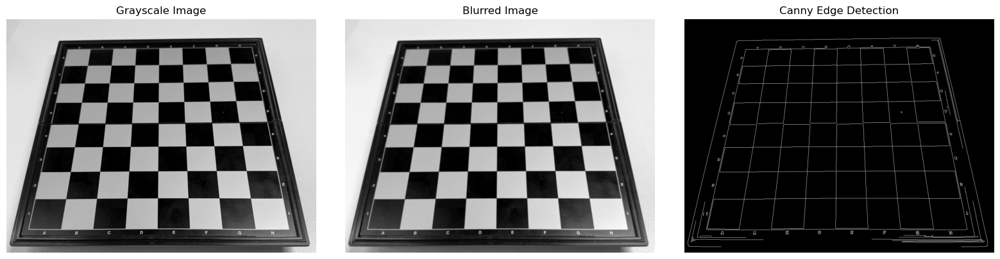
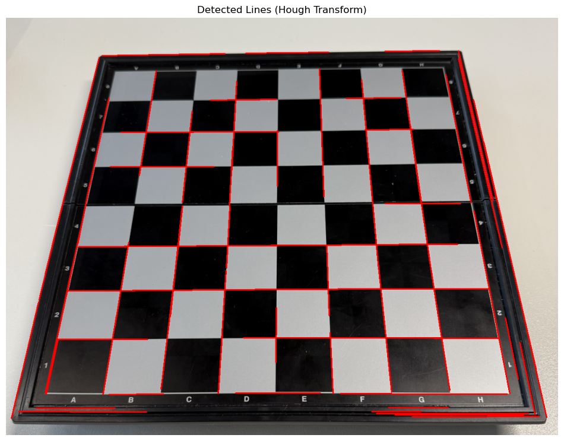
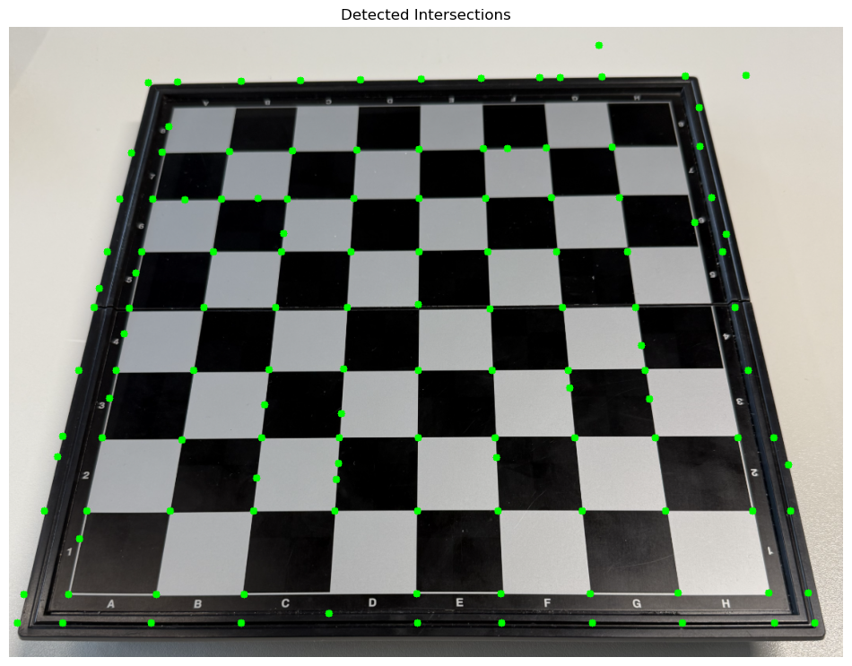
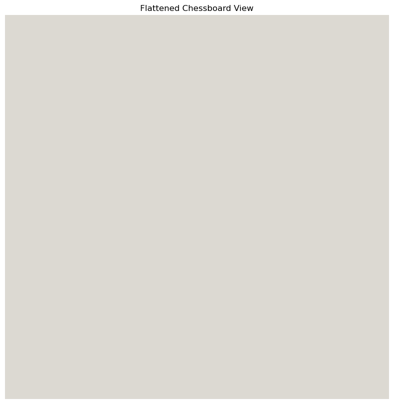
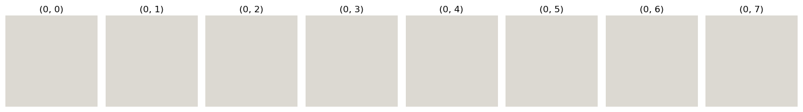

# Chess Position Recognition using Computer Vision and Deep Learning

## Introduction

Chess has fascinated humanity for centuries, not only as a game but as a powerful medium for cognitive development. In recent years, the intersection of chess with artificial intelligence and computer vision has opened new possibilities for automated chess systems. This blog explores one such innovative approach from the paper "Development of an autonomous chess robot system using computer vision and deep learning" by Truong Duc Phuc and Bui Cao Son.

In particular, we focus on Section 3 of the paper: **Chess position recognition using computer vision and deep learning algorithm**. This section describes how to take an input image of a chessboard and recognize both the board structure and the pieces on it.

## The Challenge

Recognizing a chess position from an image involves two main challenges:
1. Detecting and extracting the chessboard grid
2. Identifying the chess pieces on each square

Today, we'll implement and analyze the first part: **chessboard detection using computer vision techniques**.

## Understanding the Approach

The paper proposes a sequential approach to chessboard detection:

1. Edge detection using the Canny algorithm
2. Line detection with the Hough Line Transform
3. Finding intersection points through clustering
4. Creating a flattened, orthogonal view using Homography

Let's break down each step with illustrative code and results.

## Step 1: Edge Detection

The first step involves converting the color image to grayscale, applying Gaussian blur for noise reduction, and then using the Canny algorithm to detect edges in the image.

```python
def edge_detection(image):
    """Detect edges using the Canny algorithm as described in the paper"""
    # Convert to grayscale
    gray_image = cv2.cvtColor(image, cv2.COLOR_BGR2GRAY)
    
    # Apply Gaussian blur (5x5 kernel as mentioned in the paper)
    blurred_image = cv2.GaussianBlur(gray_image, (5, 5), 0)
    
    # Apply Canny edge detection
    # The paper uses a double threshold in the range [100, 200]
    edges = cv2.Canny(blurred_image, 100, 200)
    
    return gray_image, blurred_image, edges
```

As described in the paper, the process applies a 5×5 Gaussian filter for smoothing, followed by the Canny algorithm with a double threshold in the range [100, 200]. This helps identify the edges while filtering out noise.



## Step 2: Line Detection using Hough Transform

After obtaining the edges, we use the Hough Line Transform to detect straight lines in the image. This is crucial for identifying the grid structure of the chessboard.

```python
def line_detection(edges, min_line_length=100, max_line_gap=10):
    """Detect lines using the Hough Line Transform"""
    # Apply probabilistic Hough Line Transform
    lines = cv2.HoughLinesP(edges, rho=1, theta=np.pi/180, threshold=100,
                         minLineLength=min_line_length, maxLineGap=max_line_gap)
    
    return lines
```

The Hough Transform converts points in image space to mathematical representations in parameter space, making it easier to detect patterns like lines. We use the probabilistic version for efficiency.



## Step 3: Finding Intersection Points

The chessboard grid is defined by the intersections of its lines. We calculate these intersections and then cluster nearby points to handle slight inaccuracies in line detection.

```python
def find_line_intersections(lines, image_shape):
    """Find the intersections of all lines"""
    height, width = image_shape[0:2]
    intersections = []
    
    # Convert detected lines to line equations
    processed_lines = []
    if lines is not None:
        for line in lines:
            x1, y1, x2, y2 = line[0]
            # Calculate line equation ax + by + c = 0
            if x2 - x1 == 0:  # Vertical line
                a, b, c = 1, 0, -x1
            else:
                a = (y2 - y1) / (x2 - x1)
                b = -1
                c = y1 - a * x1
            processed_lines.append((a, b, c))
    
    # Find intersections between all pairs of lines
    for i in range(len(processed_lines)):
        for j in range(i+1, len(processed_lines)):
            a1, b1, c1 = processed_lines[i]
            a2, b2, c2 = processed_lines[j]
            
            # Calculate determinant
            det = a1 * b2 - a2 * b1
            
            # Check if lines are parallel
            if abs(det) < 1e-10:
                continue
            
            # Calculate intersection point
            x = (b1 * c2 - b2 * c1) / det
            y = (a2 * c1 - a1 * c2) / det
            
            # Only include points that are within the image
            if 0 <= x < width and 0 <= y < height:
                intersections.append((x, y))
    
    return np.array(intersections)
```

For clustering the intersection points, we employ DBSCAN (Density-Based Spatial Clustering of Applications with Noise), which naturally groups points based on their proximity:

```python
def cluster_intersections(intersections, eps=20, min_samples=1):
    """Cluster intersection points using DBSCAN"""
    if len(intersections) == 0:
        return []
        
    # Apply DBSCAN clustering
    clustering = DBSCAN(eps=eps, min_samples=min_samples).fit(intersections)
    
    # Get cluster labels and number of clusters
    labels = clustering.labels_
    n_clusters = len(set(labels)) - (1 if -1 in labels else 0)
    
    # Calculate cluster centers
    clustered_points = []
    for i in range(n_clusters):
        cluster_points = intersections[labels == i]
        center_x = np.mean(cluster_points[:, 0])
        center_y = np.mean(cluster_points[:, 1])
        clustered_points.append((center_x, center_y))
    
    return np.array(clustered_points)
```



## Step 4: Homography Transform

The final step is to use the Homography transform to create a flattened, orthogonal view of the chessboard. This transformation maps the detected chessboard corners to a square image, correcting for perspective distortion.

```python
def create_flattened_chessboard(image, intersections, board_size=8):
    """Create a flattened view of the chessboard using Homography transform"""
    # Extract the four corners of the chessboard
    # ...
    
    # Define source points (detected corners)
    src_points = np.array([top_left, top_right, bottom_right, bottom_left], dtype=np.float32)
    
    # Define destination points (rectangle)
    dst_size = 800  # Size of the output square
    dst_points = np.array([[0, 0], [dst_size, 0], [dst_size, dst_size], [0, dst_size]], dtype=np.float32)
    
    # Calculate homography matrix
    H, _ = cv2.findHomography(src_points, dst_points)
    
    # Apply perspective transformation
    flattened = cv2.warpPerspective(image, H, (dst_size, dst_size))
    
    return flattened, H
```



## Extracting Individual Squares

Once we have a flattened view, we can easily extract the individual squares of the chessboard for subsequent piece recognition:

```python
def extract_chessboard_squares(flattened_image, board_size=8):
    """Extract individual squares from the flattened chessboard"""
    height, width = flattened_image.shape[:2]
    square_size = min(height, width) // board_size
    
    squares = []
    for row in range(board_size):
        for col in range(board_size):
            # Calculate square coordinates
            top = row * square_size
            left = col * square_size
            
            # Extract the square
            square = flattened_image[top:top+square_size, left:left+square_size]
            squares.append(((row, col), square))
    
    return squares
```



## Analysis and Insights

The approach described in the paper provides a robust method for chessboard detection, but there are several interesting insights worth noting:

1. **Edge Detection Tuning**: The double threshold in Canny detection is crucial - too low and we detect too much noise, too high and we miss important edges. The paper's suggested range [100, 200] works well for standard lighting conditions.

2. **Line Detection Challenges**: The Hough transform can sometimes detect multiple lines for a single chessboard grid line, especially with shadows or reflections. Clustering helps mitigate this issue.

3. **Perspective Correction**: The homography transform is sensitive to the quality of the detected corners. If the corners are not accurately detected, the resulting flattened view may be distorted.

4. **Lighting Conditions**: The algorithm performs best under even lighting. Shadows or glare can cause issues in edge detection, which propagate through the pipeline.

## Comparison with Other Approaches

While the paper uses classical computer vision techniques for chessboard detection, alternative approaches exist:

1. **Deep Learning-Based Approaches**: Some recent methods use convolutional neural networks to directly detect chessboard corners or grid lines. These can be more robust to varying lighting and perspectives but require extensive training data.

2. **ArUco Markers**: Some systems use ArUco markers on the corners of the board for easier detection. This simplifies the detection process but requires a modified chessboard.

3. **Pattern-Based Methods**: Other approaches leverage the known pattern of alternating light and dark squares to detect the chessboard structure.

The paper's method strikes a good balance between robustness and implementation complexity, without requiring modifications to the chessboard or training data.

## Next Steps: Chess Piece Recognition

Having successfully detected and extracted the chessboard grid, the next step would be to recognize the chess pieces on each square. The paper proposes using a deep learning model trained on a dataset of chess piece images. This would involve:

1. Creating a dataset of chess piece images in various positions and lighting conditions
2. Training a convolutional neural network to classify pieces as empty, white pawn, black knight, etc.
3. Applying the trained model to each extracted square

## Conclusion

The chessboard detection approach described in this paper provides an effective foundation for chess position recognition. By using a sequence of computer vision techniques - edge detection, line detection, intersection finding, and homography transformation - we can reliably extract a standardized view of a chessboard from an image.

This implementation demonstrates how classical computer vision algorithms can be combined to solve a complex recognition problem. The next challenge is to integrate deep learning for chess piece recognition, which would complete the full chess position recognition system.

---

*This blog post is part of a literature review assignment for a Deep Learning module, examining the paper "Development of an autonomous chess robot system using computer vision and deep learning" by Truong Duc Phuc and Bui Cao Son.* 